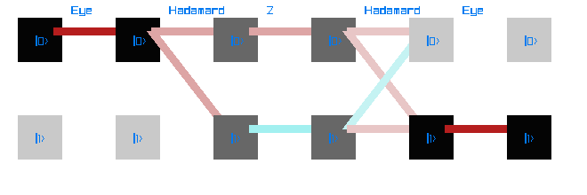

# FQAM: Formal Quantum Algorithm Methodology

A high-performance C library for formal quantum algorithm derivation, execution, and visualization.

## Overview

FQAM provides a framework for reasoning about quantum algorithms in terms of **configuration space evolution** rather than the conventional gate model. The gate model—while universal—is often unintuitive. FQAM lets you visualize how quantum state evolves through a computation, observing probability flow across basis states over time.

**Inspired by:** [FLAME (Formal Linear Algebra Methods Environment)](https://shpc.oden.utexas.edu/index.html) from UT Austin's SHPC research group.

**Designed with:** Quantum cellular automata and lattice-based quantum codes in mind.

## Features

- **Formal operator construction** — Build quantum gates from outer products (e.g., Pauli-X as |0⟩⟨1| + |1⟩⟨0|)
- **FLAME-style blocked algorithms** — Leverage partitioned matrix operations for systematic derivation
- **Feynman path visualization** — Render state evolution diagrams showing probability amplitude flow
- **High-performance backend** — Built on libflame for optimized dense linear algebra

## Example

```c
#include "FQAM.h"

int main() {
    // Initialize 1-qubit system in |0⟩ state
    FQAM_init(1, 0);
    
    // Create operators using built-in gates
    FQAM_Op H, Z;
    FQAM_hadamard(&H);
    FQAM_Pauli_z(&Z);
    
    // Build computation: H → Z → H
    FQAM_stage_append(H);
    FQAM_stage_append(Z);
    FQAM_stage_append(H);
    
    // Execute and visualize
    FQAM_Render_feynman_diagram();
    
    FQAM_finalize();
    return 0;
}
```

### Defining Operators Formally

FQAM constructs operators from outer products of basis states—the same way you'd write them mathematically:

```c
// Pauli-X gate: X = |0⟩⟨1| + |1⟩⟨0|
void FQAM_Pauli_x(FQAM_Op *A) {
    FQAM_Basis ket0, ket1;
    FQAM_Op outer0, outer1;

    FQAM_Op_create(A, "X", 1);  // 1-qubit operator

    // Create basis states
    ket0 = FQAM_Basis_create(1, 0, 0);  // |0⟩
    ket1 = FQAM_Basis_create(1, 0, 1);  // |1⟩

    // Build outer products
    FQAM_Basis_outer(ket0, ket1, &outer0);  // |0⟩⟨1|
    FQAM_Basis_outer(ket1, ket0, &outer1);  // |1⟩⟨0|

    // Sum terms: X = 1·|0⟩⟨1| + 1·|1⟩⟨0|
    FQAM_Op_add(FQAM_ONE, outer0, A);
    FQAM_Op_add(FQAM_ONE, outer1, A);
}

// Hadamard gate: H = (1/√2)(|0⟩⟨0| + |0⟩⟨1| + |1⟩⟨0| - |1⟩⟨1|)
void FQAM_hadamard(FQAM_Op *A) {
    FQAM_Basis ket0, ket1;
    FQAM_Op outer00, outer01, outer10, outer11;

    FQAM_Op_create(A, "H", 1);

    ket0 = FQAM_Basis_create(1, 0, 0);
    ket1 = FQAM_Basis_create(1, 0, 1);

    // All four outer products
    FQAM_Basis_outer(ket0, ket0, &outer00);  // |0⟩⟨0|
    FQAM_Basis_outer(ket0, ket1, &outer01);  // |0⟩⟨1|
    FQAM_Basis_outer(ket1, ket0, &outer10);  // |1⟩⟨0|
    FQAM_Basis_outer(ket1, ket1, &outer11);  // |1⟩⟨1|

    // Sum with coefficients (FQAM_PI4 = e^(iπ/4)/√2)
    FQAM_Op_add(FQAM_PI4, outer00, A);   // +1/√2
    FQAM_Op_add(FQAM_PI4, outer01, A);   // +1/√2
    FQAM_Op_add(FQAM_PI4, outer10, A);   // +1/√2
    FQAM_Op_add(FQAM_7PI4, outer11, A);  // -1/√2
}
```

**Output:** A Feynman path diagram showing state transitions through each gate:



## Building

### Dependencies

- [libflame](https://github.com/flame/libflame) — FLAME linear algebra library
- [raylib](https://github.com/raysan5/raylib) — Visualization rendering
- A BLAS implementation (OpenBLAS, MKL, or reference BLAS)

## Status

**Active development.** Core functionality (operator construction, state evolution, visualization) is working. Planned additions include:

- Tensor product operations for multi-qubit systems
- Lattice partitioning for cellular automata simulation
- QLDPC code generation utilities

## License

BSD 3-Clause. See [LICENSE](LICENSE) for details.

## Acknowledgments

- [FLAME project](https://shpc.oden.utexas.edu/index.html) for the methodology
- [Marek Web](https://github.com/marekweb/datastructs-c) for arraylist implementation
- [Leiless](https://github.com/leiless/assertf.h) for assertf macro library
